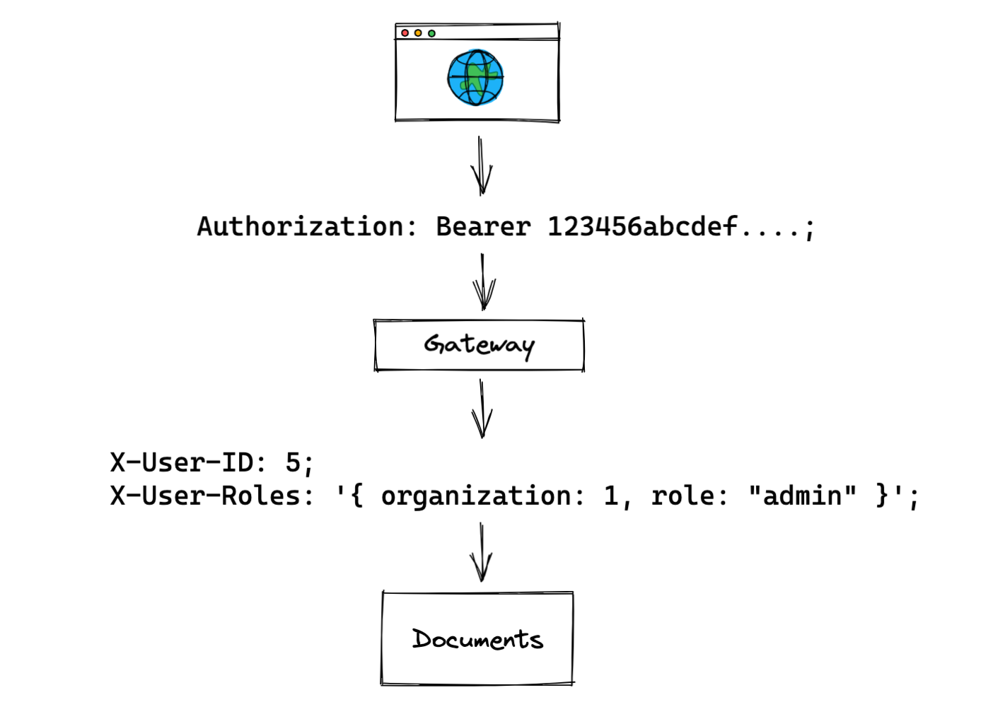

# boilerplate_gatetay

## Getting started
```shell
docker run -d --name httpbin -p 8888:80 kennethreitz/httpbin
```

##



GATEWAY
- https://www.osohq.com/post/microservices-authorization-patterns

WEBFLUX
- https://stackoverflow.com/questions/47182961/copy-of-the-request-response-body-on-a-spring-reactive-app
- https://medium.com/riiid-teamblog-kr/spring-webflux-%EC%97%90%EC%84%9C-corouter-filter%EB%A5%BC-%EC%9D%B4%EC%9A%A9%ED%95%98%EC%97%AC-request-response-%EB%A1%9C%EA%B9%85%ED%95%98%EA%B8%B0-df56f9d9680

AUTH
- https://www.ssemi.net/what-is-the-oauth2/
- https://www.rfc-editor.org/rfc/rfc6749.html
- https://www.baeldung.com/spring-cloud-custom-gateway-filters

KEYCLAOK
- https://github.com/ali-bouali/keycloak-integration-with-spring-boot-3
- https://github.com/rbiedrawa/spring-webflux-keycloak-demo
- https://www.youtube.com/watch?v=vmEWywGzWbA

GW
- https://docs.konghq.com/hub/kong-inc/openid-connect/
- https://couper.io/en/open-id-connect-gateway/
- https://docs.nginx.com/nginx/deployment-guides/single-sign-on/keycloak/

